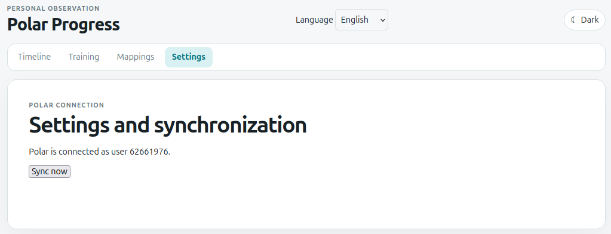
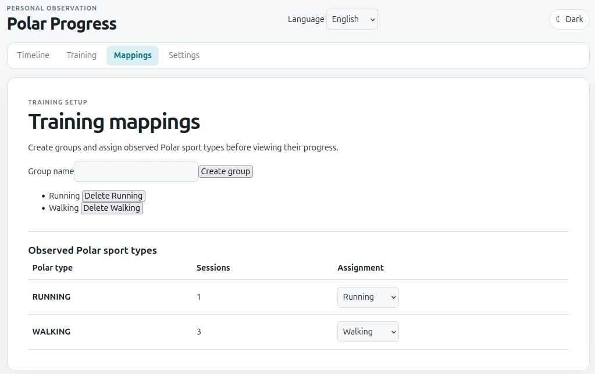
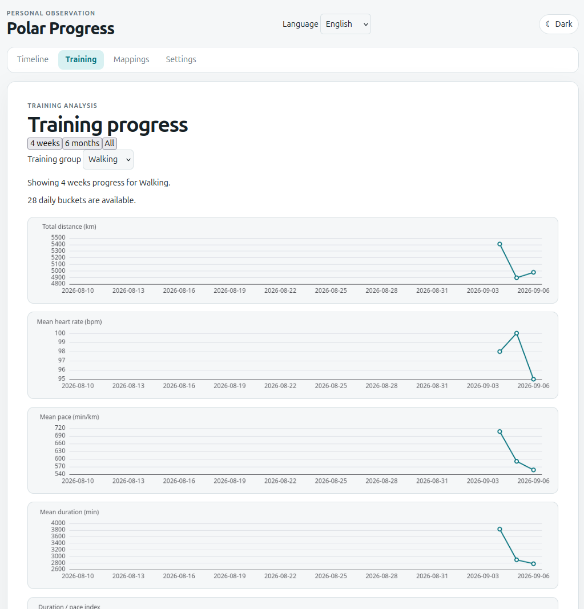
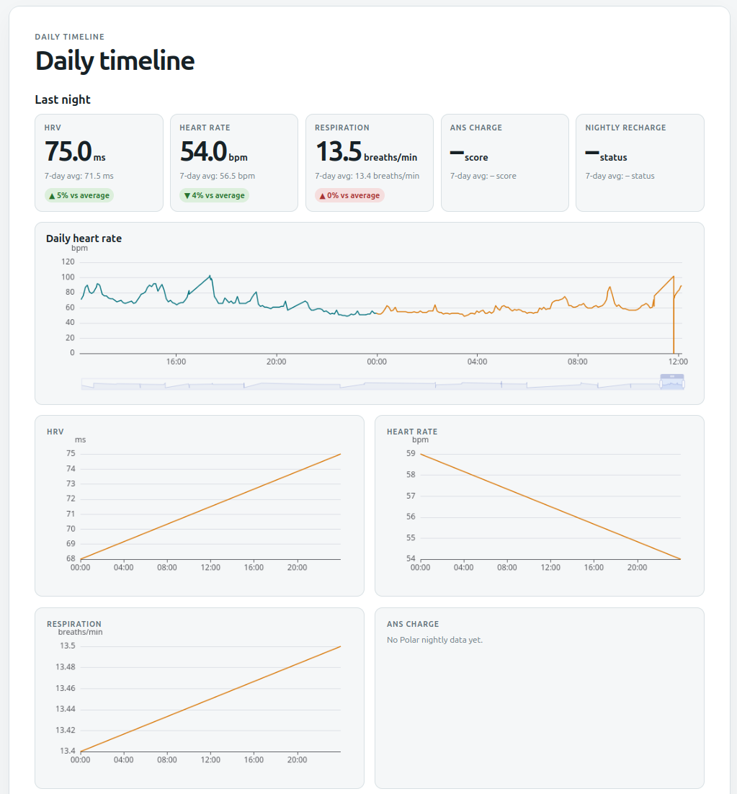
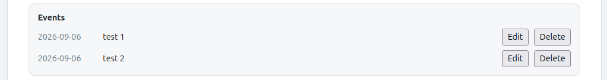

# Personal note

This project started as an experiment for two reasons:

- First, I passed the sixties last year and felt the urgent need to do more for my  health. So I bought a Polar Watch to keep an eye on my training pulse and the overall progress. 
  
  Polar offers various ways to watch your training data. But everything is spread over several pages in either the smartphone app or on the web pages. And I wanted the few most important bits in one place.

- Second, I have been programming for over four decades now and in that time I created some rather successful pieces of OpenSource code. But now is the time of the AI! What can you do with it, in what time - and what could even a non-programmer achieve? 
  Short answer: a skilled programmer can do a lot very quickly even if he has little domain knowledge. This app took maybe 10 working hours to implement and was mainly slowed down because I ran into Codex usage limits. 5 hours worth in tokens was sometimes burnt in 30 minutes. I employed GPT-Sol for planning and mostly GPT-Terra for coding. 
  A non-skilled programmer would probably have failed. At least in my approach. I had to help Codex by advising details, debugging, copying texts around, setting up a Polar account and finally enable remote debugging in Chrome. 

For these reasons I decided to put my Codex account to good use and make an agent implement a web based progress monitor based on my personal Polar data. The app itself is rather simple and contains the four tabs:

- A settings page to connect to Polar services and sync manually.
 
  

- Mappings offers the possibility to map the different Polar training names to a single collector. For example Polar has Running, Jogging, Trail and so on which I summarize all as Running.
  
  

 - Trainings shows the summaries of your trainings with distance, average heart rate, average pace, distance and and index I wanted additionally which calcuate duration over pace. 
  
   

 - Timeline shows dailiy activity and values based on your sleep data.
  
The five tiles at the top contain last night's values for 
 - Heart rate variability
 - Lowest heart rate
 - Average respirations per minute
 - **ANS** is a rating value for the sleep phases
 - **Recharge** tells you how much rest you got from last nights sleep.

**ANS** and **Recharge** are specific Polar values.

Below the tiles you have the daily activity log that Polar collects while wearing the watch over the day.

Next there are the charts for HRV, heart rate and so on for the last 28 days.

  

One special feature is not obvious: if you hover over one of the lines, markers appear for each recorded point in time. A double click opens a dialog where you can enter descriptions for special events that might affect your sleep. Think of it as a simple diary. Maybe you want to find out how drinking coffee reduces your sleep. Then you can hover over the time lines to find out if you have noted something for that day. Active events also change the line color.

At the bottom all such events are listed and you can edit or delete them.

  

**If you plan to modify this app**, maybe connect it to your Garmin: **use the AI project**. It contains all the data I developed together with the AI. Every planning details, every todo, every step in the logs is still available. Load [MAIN.md](AI/MAIN.md) into your agent and tell it you want changed. It contains all the links your agent needs to learn about the app.

The rest of this README is AI-generated, as is each and every file in this project. I did not touch a single line myself. Though I did read some to learn about the internals :-)

# Polar Web App

A private, self-hosted dashboard for importing Polar AccessLink data and reviewing recovery, heart-rate, and training trends. It is intended for personal observation and progress tracking, **not** medical diagnosis.

## What it does

- Connects to Polar through OAuth; no Polar account password is stored.
- Syncs Polar data automatically every hour and supports manual sync.
- Shows a Timeline with nightly HRV, heart rate, respiration, ANS charge, Nightly Recharge, and a rolling 24-hour continuous-heart-rate chart when Polar provides the data.
- Shows Training Progress charts for user-defined sport groups: distance, heart rate, pace, duration, and duration/pace index.
- Supports English, German, and Russian plus light/dark themes.
- Stores all local data in SQLite under `database/`.

## Quick start (native)

Requirements:

- Python 3.11+
- [uv](https://docs.astral.sh/uv/)
- Node.js and npm (only needed to build the frontend from source)

```bash
# Install production Python dependencies.
bash scripts/install-python-runtime-libs.sh

# Build browser assets.
bash scripts/build.sh

# Start the app, including migrations and the hourly scheduler.
bash scripts/run.sh
```

Open <http://localhost:8000> on the server, or `http://<server-LAN-IP>:8000` from another device on the trusted home network. Keep Polar OAuth on the server's `localhost` URL; network binding does not change its callback configuration.

This checkout may be on a `noexec` CIFS mount. Invoke repository scripts with `bash`, as shown above.

## Connect Polar

1. Create a Polar AccessLink client.
2. Copy `.env.example` to `.env` and set the client credentials, exact redirect URI, and Fernet encryption key.
3. Start the app and open <http://localhost:8000/settings>.
4. Select **Connect Polar**, complete Polar Flow consent, then select **Sync now**.

The complete, GitHub-safe setup guide is [AI/POLAR_AUTH_SETUP.md](AI/POLAR_AUTH_SETUP.md). In particular, keep `.env`, the SQLite database, OAuth tokens, the Polar client secret, and the Fernet key out of Git.

## Short user guide

### Timeline

- The top tiles show the latest nightly value, seven-day average, and comparison where data is available.
- Hover a chart for an exact value and crosshair.
- Double-click a Timeline datapoint to create a dated free-text special event. Event dates change the chart line color and the event appears in the hover tooltip; manage existing events at the bottom of the Timeline.

### Training Progress

- Create a group on **Mappings** (for example, `Running`).
- Map observed Polar sport types to that group, or leave them unmapped/ignored.
- Open **Training** and choose the group and range (`4 weeks`, `6 months`, or `All`).
- Hover synchronized charts for values; select a bucket to inspect contributing sessions.

### Settings

- **Sync now** imports currently available Polar records and reports new, updated, unchanged, and failed records by category.
- Settings shows the time of the last successful scheduled sync and refreshes that status every minute while open.
- After Polar is connected, the in-process scheduler re-syncs every 60 minutes by default. Set `POLAR_APP_SYNC_INTERVAL_MINUTES` in `.env` to change the interval.

## Backups

Create an online, integrity-checked SQLite backup while the application is running:

```bash
bash scripts/backup-database.sh
```

The command prints the new file under `database/backups/`. Restore instructions and safety checks are in [AI/DEPLOYMENT.md](AI/DEPLOYMENT.md). Backups contain personal health data and must remain outside Git.

## Development and documentation

Use `bash scripts/install-python-libs.sh` when backend test and development dependencies are also needed. See [AI/DEPLOYMENT.md](AI/DEPLOYMENT.md) for runtime and storage details, and [AI/DOCUMENTATION.md](AI/DOCUMENTATION.md) for the project documentation map.

## Security and privacy

The application is private by default. Do not expose it to the public internet without authentication and HTTPS. Do not commit `.env`, SQLite databases, backups, tokens, credentials, or personal Polar data.
